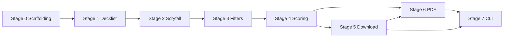

# TDD Roadmap

Test-first development roadmap for Card Downloader. Every stage follows:

```
write failing tests → pytest red → implement minimal code → pytest green → refactor
```

Do **not** start stage N+1 until stage N definition of done is met.

CLI and full pipeline wiring are **Stage 7 only**. All business logic is unit-tested in Stages 1–6.

---

## Stage 0 — Scaffolding

**Goal:** Project structure, tooling, and empty module tree. No feature logic.

### Create

| Item | Details |
|------|---------|
| `pyproject.toml` | Package `card-downloader`, Python ≥3.11, `[project.scripts]`, pytest config |
| Runtime deps | `requests`, `Pillow`, `img2pdf` |
| Dev deps | `pytest`, `pytest-cov`, `responses` |
| `src/card_downloader/` | Empty package tree per architecture ( `__init__.py` only ) |
| `tests/unit/` | Mirrored subdirs: `decklist/`, `scryfall/`, `selection/`, `download/`, `manifest/`, `sheets/` |
| `tests/integration/` | Empty except `__init__.py` or placeholder |
| `tests/fixtures/` | Subdirs: `decklists/`, `cards/`, `scryfall/`, `images/` |
| `tests/conftest.py` | `fixtures_dir` pytest fixture |
| `data/decklists/example-commander.txt` | Copy from `old_Python/decklist.txt` |
| `tests/test_smoke.py` | Single `assert True` or import smoke test |

### Verify

```bash
pip install -e ".[dev]"
pytest
```

### Definition of done

- [ ] `pytest` exits 0
- [ ] Module tree matches `docs/project-plan.md` architecture
- [ ] `.gitignore` excludes `data/runs/`, `data/cache/`, images, PDFs (extend if needed)
- [ ] No business logic implemented
- [ ] `old_Python/` untouched

---

## Stage 1 — Decklist normalisation and parsing

**Goal:** Parse decklist files into structured, normalised entries.

**Modules:** `decklist/models.py`, `decklist/normalize.py`, `decklist/parser.py`

### Tests first

**`tests/unit/decklist/test_normalize.py`**

| Test case | Input → expected |
|-----------|------------------|
| Curly apostrophe | `Urza's Saga` (U+2019) → `Urza's Saga` (ASCII `'`) |
| Curly double quotes | Normalise if present |
| Whitespace | Trim leading/trailing; collapse internal double spaces |
| NFC | Composed Unicode normal form |

**`tests/unit/decklist/test_parser.py`**

| Test case | Expected |
|-----------|----------|
| Quantity line | `1 Sol Ring` → `DeckEntry(qty=1, name="Sol Ring")` |
| Multi-digit quantity | `11 Snow-Covered Mountain` → qty=11 |
| Optional x suffix | `1x Sol Ring` → qty=1 |
| Bare name | `Sol Ring` → qty=1 (default) |
| Comment line | `# main deck` → skipped |
| Empty line | skipped |
| Sideboard marker | `[Sideboard]` → stop parsing or skip section |
| Full fixture | Parse `example-commander.txt` → 94 entries, correct total quantity |

### Then implement

1. `models.py` — `@dataclass(frozen=True) DeckEntry`, `ParsedDeck` with `entries: list[DeckEntry]`
2. `normalize.py` — `normalize_name(name: str) -> str`
3. `parser.py` — `parse_line(line: str) -> DeckEntry | None`, `parse_decklist(text: str) -> ParsedDeck`

### Definition of done

- [ ] All Stage 1 tests green
- [ ] No Scryfall, no CLI
- [ ] 100% of parser/normalize lines covered by unit tests

---

## Stage 2 — Scryfall pagination, cache, client (mocked HTTP)

**Goal:** Fetch all printings for a card name with pagination, caching, and rate limiting — tested without live network.

**Modules:** `scryfall/models.py`, `scryfall/protocols.py`, `scryfall/pagination.py`, `scryfall/cache.py`, `scryfall/rate_limit.py`, `scryfall/client.py`

### Tests first

**`tests/unit/scryfall/test_pagination.py`**

- Merge two fixture pages into one list
- Stop when `has_more` is false
- Handle empty first page

**`tests/unit/scryfall/test_cache.py`**

- Cache miss → fetch → cache hit
- Stable cache key for same query
- Cache directory created under configurable path

**`tests/integration/scryfall/test_client.py`** (uses `responses`)

- Mock `GET /cards/search` returning fixture JSON
- Client returns list of `CardPrinting` models
- Respects rate limiter (mock sleep callable)
- Pagination: two-page response returns combined results

### Fixtures

- `tests/fixtures/scryfall/search_sol_ring_page1.json`
- `tests/fixtures/scryfall/search_sol_ring_page2.json` (if needed)

### Then implement

1. `protocols.py` — `HttpClient`, `CacheStore` protocols
2. `models.py` — `CardPrinting.from_api_dict(dict)`
3. `pagination.py` — pure `collect_pages(first_response, fetch_page) -> list[dict]`
4. `cache.py` — `FileCache`
5. `rate_limit.py` — `RateLimiter` with injectable `sleep`
6. `client.py` — `ScryfallClient.search_printings(name) -> list[CardPrinting]`

### Definition of done

- [ ] All Stage 2 tests green
- [ ] Zero live HTTP in `pytest`
- [ ] Client returns printings for fixture card name

---

## Stage 3 — Candidate filtering and classification

**Goal:** Hard-exclude unusable printings; tag survivors with classification metadata.

**Modules:** `selection/models.py`, `selection/filters.py`, `selection/classify.py`

### Tests first

**`tests/unit/selection/test_filters.py`**

- Exclude: `digital: true`
- Exclude: `image_status: "missing"`, no `image_uris`
- Exclude: `layout: "token"`
- Keep: normal playable card fixture

**`tests/unit/selection/test_classify.py`**

- `border_color: "black"` → tier good
- `border_color: "white"` → tier bad
- `"showcase" in frame_effects` → special frame
- `"nonfoil" in finishes` → nonfoil available
- UB id in provided set → `is_ub=True`

### Fixtures

- `tests/fixtures/cards/sol_ring_normal.json`
- `tests/fixtures/cards/plateau_white_border.json`
- `tests/fixtures/cards/token_example.json`
- `tests/fixtures/cards/showcase_example.json`

### Then implement

1. `selection/models.py` — `Candidate`, `Classification`, `SelectionOptions`
2. `filters.py` — `hard_exclude(card, opts) -> bool`
3. `classify.py` — pure classification helpers

### Definition of done

- [ ] All Stage 3 tests green
- [ ] No scoring or optimizer yet

---

## Stage 4 — Scoring, anchors, optimiser, fallback, manifest rows

**Goal:** Score printings, pick anchor set, assign printings globally, explain fallbacks, serialise manifest.

**Modules:** `selection/scoring.py`, `selection/anchors.py`, `selection/optimizer.py`, `selection/fallback.py`, `selection/config.py`, `manifest/schema.py`, `manifest/writer.py`, `manifest/reader.py`

### Tests first

**`tests/unit/selection/test_scoring.py`**

- Normal printing scores higher than showcase UB promo
- `--allow-ub` removes UB penalty
- Score breakdown sums to total

**`tests/unit/selection/test_anchors.py`**

- Ranks set by coverage count
- Includes set-group keys

**`tests/unit/selection/test_optimizer.py`**

- 5-card synthetic pools: anchor with 3/5 coverage wins over independent per-card if coherence weight high enough
- Outlier gets global best + penalty
- Plateau stays outlier with best white-border printing

**`tests/unit/selection/test_fallback.py`**

- `white_border_unavoidable` when all borders white
- `outlier_from_anchor:clu` when not in anchor

**`tests/unit/manifest/test_schema.py`**

- Manifest round-trip JSON
- Required fields present
- `selection_summary`, `cards[]`, `outputs` structure

### Then implement

1. `config.py` — default weights
2. `scoring.py` — `score_printing(candidate, opts) -> ScoreBreakdown`
3. `anchors.py` — `rank_anchors(pools) -> list[Anchor]`
4. `optimizer.py` — `best_assignment(pools, anchors, opts) -> Assignment`
5. `fallback.py` — `fallback_reasons(...)`
6. `manifest/schema.py`, `writer.py`, `reader.py`

### Definition of done

- [ ] All Stage 4 tests green
- [ ] Synthetic deck writes valid `manifest.json` via writer
- [ ] No image download or PDF yet

---

## Stage 5 — Image download and safe filenames

**Goal:** Download PNG bytes from manifest; deterministic filesystem names.

**Modules:** `download/filenames.py`, `download/images.py`

### Tests first

**`tests/unit/download/test_filenames.py`**

- `Sol Ring` + set `clu` + `123` → safe path
- Slashes/colons in name sanitised
- DFC → `__front` suffix

**`tests/integration/`** (or unit with tmp_path + mocked HTTP)

- Download writes file to disk
- Skip if exists unless `--force`
- Failed download recorded; does not crash batch

### Then implement

1. `filenames.py` — pure path helpers
2. `images.py` — `ImageDownloader` using `HttpClient`

### Definition of done

- [ ] All Stage 5 tests green
- [ ] Port patterns from `old_Python/download_scryfall_images backup.py`

---

## Stage 6 — 3×3 sheet geometry, image preparation, PDF builder

**Goal:** Printer-ready PDF matching legacy `make_proxy_sheets.py` specs.

**Modules:** `sheets/constants.py`, `sheets/geometry.py`, `sheets/slots.py`, `sheets/image_prep.py`, `sheets/builder.py`

### Tests first

**`tests/unit/sheets/test_geometry.py`**

- `page_count(106) == 12` (ceil(106/9))
- Grid fits A4 at 300 DPI
- Slot (0,0) coordinates match expected pixel values

**`tests/unit/sheets/test_slots.py`**

- Deck order preserved
- Quantity 11 → 11 slots with same image path
- 94 entries with quantities → correct total slot count

**`tests/unit/sheets/test_image_prep.py`**

- Transparent PNG → flattened on black
- Output dimensions match card size at DPI

**`tests/integration/sheets/test_builder.py`**

- Build PDF from fixture images → file exists, non-zero size
- Page count matches geometry

### Legacy spec (must match)

| Setting | Value |
|---------|-------|
| Grid | 3×3 |
| Card | 2.5″ × 3.5″ |
| Gap | 1 mm |
| Background | Black |
| Paper | A4 default |
| DPI | 300 |

### Then implement

Port from `old_Python/make_proxy_sheets.py`:

1. `constants.py`
2. `geometry.py` — pure math
3. `slots.py` — `expand_to_slots(parsed_deck, manifest)`
4. `image_prep.py` — PIL flatten + resize
5. `builder.py` — page assembly + img2pdf

### Definition of done

- [ ] All Stage 6 tests green
- [ ] PDF page count correct for example deck slot total
- [ ] Dimensions match legacy script

---

## Stage 7 — Thin pipeline and CLI integration

**Goal:** Wire modules together; no new business logic in CLI.

**Modules:** `pipeline/plan.py`, `pipeline/download.py`, `cli/main.py`, `cli/commands/*`

### Tests first

**`tests/integration/test_pipeline_with_fixtures.py`**

- Mock Scryfall → plan → manifest golden snapshot (small 5-card deck)
- Mock images → download → PDF exists
- End-to-end with fixtures only (no live API)

Optional:

- CLI `--help` smoke via subprocess

### Then implement

1. `pipeline/plan.py` — orchestrate parse → fetch → filter → score → optimize → write manifest
2. `pipeline/download.py` — manifest → images → slots → PDF
3. `cli/commands/plan.py`, `download.py`, `explain.py`, `sheets.py`, `cache.py`
4. `cli/main.py` — argparse dispatch

### Definition of done

- [ ] Integration tests green
- [ ] `card-downloader plan` and `card-downloader download` work with fixtures
- [ ] README updated with usage examples
- [ ] Optional manual run against live Scryfall + example decklist
- [ ] `old_Python/` can be deprecated (not necessarily deleted)

---

## Dependency graph between stages



Stage 6 depends on manifest (Stage 4) and benefits from download (Stage 5) but PDF builder unit tests can use fixture image paths directly.

---

## Running tests during development

```bash
# Full suite
pytest

# Single stage focus
pytest tests/unit/decklist/
pytest tests/unit/selection/ -v

# With coverage
pytest --cov=card_downloader --cov-report=term-missing
```

---

## What not to do in early stages

| Stage | Avoid |
|-------|-------|
| 0–1 | Scryfall calls, CLI, scoring |
| 2 | Optimizer, PDF |
| 3–4 | Image download, HTTP to image URLs |
| 5–6 | Live Scryfall in tests |
| 7 | Business logic in CLI commands — delegate to pipeline |

---

## Next steps after this document

Execute **Stage 0**, then **Stage 1** (tests before code). See summary at end of planning run.
